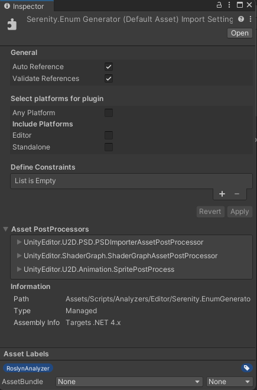
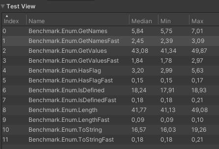

# Serenity.EnumGenerator
[](https://raw.githubusercontent.com/serenitystudio/Serenity.EnumGenerator/master/LICENSE)

[](https://github.com/serenitystudio/Serenity.EnumGenerator/releases)

A Unity compatible C# source generator to create an extension class for enums to use garbage and speed efficiently.

There are several source generators for enums which use incremental source generator or not compatible Microsoft.CodeAnalysis.Analyzers, so I made another one for Unity.

## Installation
Minimum supported Unity version is Unity `2021.2` because of `netstandard2.1` support of the project.

1. Download `Serenity.EnumGenerator.dll` file from [Release Page](https://github.com/serenitystudio/Serenity.EnumGenerator/releases)
2. Move the dll file into the Assets folder, or any folder nested inside of the Assets folder, in your Unity project.
3. Click on the .dll file inside the Asset Browser inside Unity to open the `Plugin Inspector` window.
4. Under the `Select platforms for plugin` heading, disable `Any Platform`. 
5. Under the `Include Platforms` heading, disable `Editor` and `Standalone`.
6. Under the `Asset Labels` heading in the Plugin Inspector window, click on the blue label icon to open the `Asset Labels` sub-menu.
7. Create and assign a new label called RoslynAnalyzer



For more information on Unity and Source Generator, please refer to the [Unity Documentation](https://docs.unity3d.com/Manual/roslyn-analyzers.html).

## Quick Start
To use the generator, add the `[EnumExtensions]` attribute to an enum. The attribute is also auto generated. It will generate a class under same namespace.

Flags attribute is optional. If you add, it generates `HasFlagFast` method. For example:

```csharp
namespace TestNamespace
{
    [EnumGenerator]
    [Flags]
    public enum TestEnum
    {
        First = 0,
        Second = 1,
        Third = 2,
        Flag = Second | Third
    }
}
```

Source generator generates a class called `TestEnumExtions.g.cs` which contains several extension and util methods. 

## Generated Methods
You can see usage of generated methods below:

```csharp
int length = TestEnumExtensions.Length;

string enumStr = TestEnum.First.ToStringFast();

TestEnum[] values = TestEnumExtensions.GetValuesFast();

string[] names = TestEnumExtensions.GetNamesFast();

bool isDefined = TestEnumExtensions.IsDefinedFast(TestEnum.First);

bool hasFlag = TestEnum.Flag.HasFlagFast(TestEnum.Second);
```

Generated methods are:
```csharp
 using System;

 namespace TestNamespace
 {
     public static partial class TestEnumExtensions
     {
         public const int Length = 4;

         public static string ToStringFast(this TestEnum value)
         {
             return value switch
             {
                 TestEnum.First => nameof(TestEnum.First),
                 TestEnum.Second => nameof(TestEnum.Second),
                 TestEnum.Third => nameof(TestEnum.Third),
                 TestEnum.Flag => nameof(TestEnum.Flag),
                 _ => value.ToString()
             };
         }

         public static TestEnum[] GetValuesFast()
         {
             return new[]
             {
                 TestEnum.First,
                 TestEnum.Second,
                 TestEnum.Third,
                 TestEnum.Flag,
             };
         }

         public static string[] GetNamesFast()
         {
             return new[]
             {
                 nameof(TestEnum.First),
                 nameof(TestEnum.Second),
                 nameof(TestEnum.Third),
                 nameof(TestEnum.Flag),
             };
         }

         public static bool IsDefinedFast(TestEnum value)
         {
             return value switch
             {
                 TestEnum.First => true,
                 TestEnum.Second => true,
                 TestEnum.Third => true,
                 TestEnum.Flag => true,
                 _ => false
             };
         }

         public static bool HasFlagFast(this TestEnum value, TestEnum flag)
         {
             return flag == 0 ? true : (value & flag) == flag;
         }
     }
 }
```

## Benchmark

``` ini
BenchmarkDotNet=v0.13.5, OS=Windows 11 (10.0.22000.1817/21H2/SunValley)
AMD Ryzen 5 2600, 1 CPU, 12 logical and 6 physical cores
.NET SDK=7.0.202
  [Host]   : .NET 7.0.4 (7.0.423.11508), X64 RyuJIT AVX2
  ShortRun : .NET 7.0.4 (7.0.423.11508), X64 RyuJIT AVX2

Job=ShortRun  Runtime=.NET 7.0  IterationCount=32  
LaunchCount=1  WarmupCount=6  
```
| Method        |        Mean |     Error |    StdDev |      Median |  Ratio |   Gen0 | Allocated | Alloc Ratio |
|:--------------|------------:|----------:|----------:|------------:|-------:|-------:|----------:|------------:|
| EnumLength    | 388.0759 ns | 3.0200 ns | 4.6118 ns | 387.5962 ns |   1.00 | 0.0324 |     136 B |        1.00 |
| LengthFast    |   0.0009 ns | 0.0019 ns | 0.0027 ns |   0.0000 ns |   0.00 |      - |         - |        0.00 |
| EnumToString  |   21.480 ns | 0.3130 ns | 0.4873 ns |           - |   1.00 | 0.0057 |      24 B |        1.00 |
| ToStringFast  |    3.580 ns | 0.0217 ns | 0.0338 ns |           - |   0.17 |      - |         - |        0.00 |
| EnumGetValues |  366.393 ns | 1.8478 ns | 2.8767 ns |           - |   1.00 | 0.0324 |     136 B |        1.00 |
| GetValuesFast |    7.552 ns | 0.1282 ns | 0.1918 ns |           - |   0.02 | 0.0096 |      40 B |        0.29 |
| EnumGetNames  |    23.54 ns |  0.308 ns |  0.442 ns |           - |   1.00 | 0.0134 |      56 B |        1.00 |
| GetNamesFast  |    13.15 ns |  0.213 ns |  0.331 ns |           - |   0.56 | 0.0134 |      56 B |        1.00 |
| EnumIsDefined |  18.7470 ns | 0.0826 ns | 0.1131 ns |  18.7423 ns |  1.000 |      - |         - |          NA |
| IsDefinedFast |   0.0053 ns | 0.0036 ns | 0.0057 ns |   0.0035 ns |  0.000 |      - |         - |          NA |
| HasFlag       |    281.9 ns |   1.74 ns |   2.55 ns |           - |   1.00 |      - |         - |          NA |
| HasFlagFast   |    283.7 ns |   1.77 ns |   2.53 ns |           - |   1.01 |      - |         - |          NA |

### Same system in Unity:
``` ini
Unity: 2022.2.15f1
com.unity.test-framework": 1.1.33
com.unity.test-framework.performance: 3.0.0-pre.2
Scripting Backend: Mono
Api Compatibility Level: .Net Standard 2.1

WarmupCount = 6 
MeasurementCount = 32 
IterationsPerMeasurement = 10000
```


## License

Serenity.EnumGenerator is Copyright © 2023 [Serenity Studios](https://github.com/serenitystudio) under the MIT License.